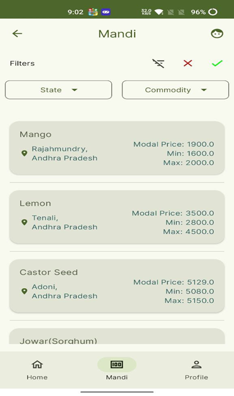

<!DOCTYPE html>
<html lang="en">
<head>
  <meta charset="UTF-8">
  <meta name="viewport" content="width=device-width, initial-scale=1.0">
  Image Gallery
</head>
<body>

<table>
  <tr>
    <td>Login Screen</td>
    <td>Registration Screen</td>
    <td>Profile Screen</td>
  </tr>
  <tr>
    <td valign="top"></td>
    <td valign="top"></td>
    <td valign="top"></td>
  </tr>
   <tr>
    <td>Home Screen (Farmer)</td>
    <td>Update Product Screen(Farmer)</td>
    <td>Add Product Screen (Farmer)</td>
  </tr>
  <tr>
    <td valign="top"></td>
    <td valign="top"></td>
    <td valign="top"></td>
  </tr>
  <tr>
    <td>Add Product Screen (Farmer)</td>
    <td>Home Screen (Customer)</td>
    <td>Product Screen(Customer)</td>
  </tr>
  <tr>
    <td valign="top"></td>
    <td valign="top"></td>
    <td valign="top"></td>
    
  </tr>
  <tr>
    <td>Mandi Screen</td>
    <td>Ai Assistant Screen</td>
<!--     <td>Image 12</td> -->
  </tr>
  <tr>
    <td valign="top"></td>
    <td valign="top"></td>
<!--     <td valign="top"></td> -->
  </tr>
  <tr>
    <td>Image 13</td>
    <td>Image 14</td>
    <td></td>
  </tr>
  
</table>

</body>
</html>
